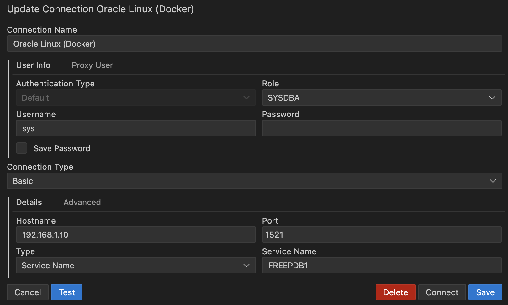

# Oracle database

## Exposed ports

- 1521: Oracle database

## How to connect (VS Code)

1. Install the [Oracle SQL Developer Extension for VSCode](https://marketplace.visualstudio.com/items?itemName=Oracle.sql-developer)
2. Add a new connection with the following settings
   - `role` SYSDBA
   - `username` sys
   - `password` oracledocker
   - `service name` FREEPDB1



## Useful commands

```bash
# sqlplus $user/$password@$host:$port/$schema
docker compose run oracle-db sqlplus pdbadmin/oracledocker@oracle-db:1521/FREEPDB1
```

## Useful links

- [GitHub - Docker build files](https://github.com/oracle/docker-images)
- [Oracle database software downloads](https://www.oracle.com/database/technologies/oracle-database-software-downloads.html)
